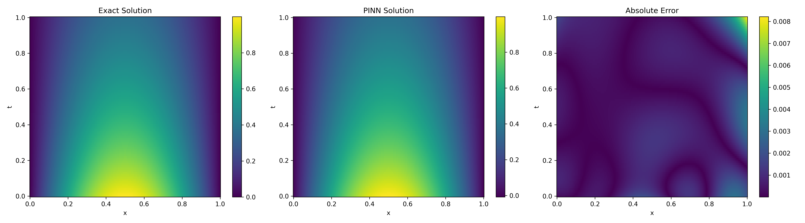
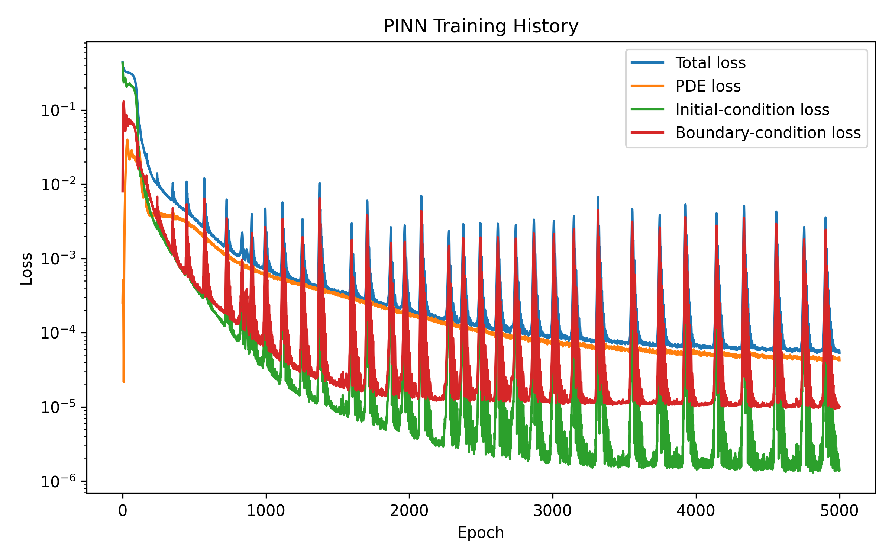
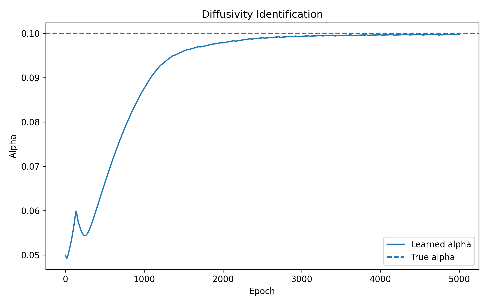
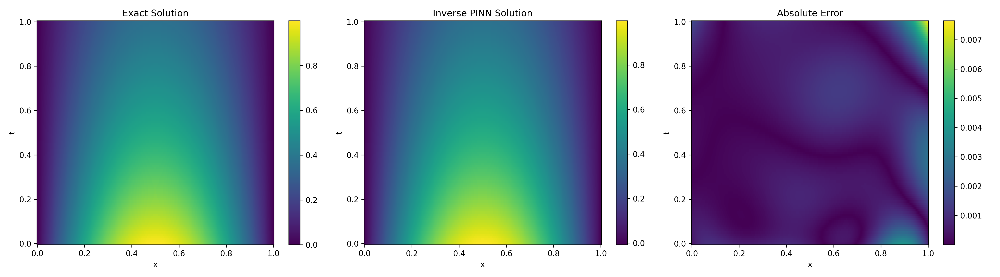
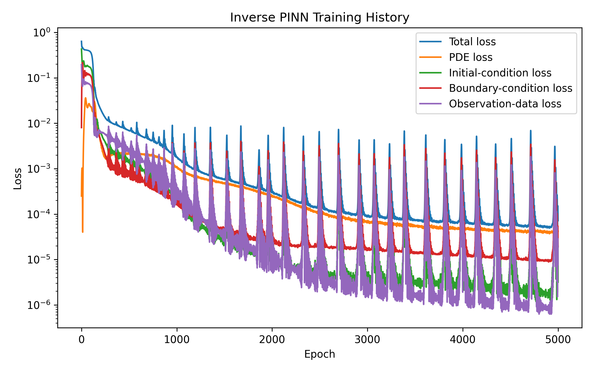

# Forward and Inverse PINNs for the 1D Heat Equation

This repository implements forward and inverse physics-informed neural networks for the one-dimensional heat equation using PyTorch.

The forward PINN approximates the temperature field when the thermal diffusivity is known. The inverse PINN estimates the unknown thermal diffusivity from temperature observations.

## Problem

The heat equation is

$$u_t-\alpha u_{xx}=0,\qquad 0\leq x\leq1,\qquad 0\leq t\leq1.$$

The initial condition is

$$u(x,0)=\sin(\pi x).$$

The boundary conditions are

$$u(0,t)=0,\qquad u(1,t)=0.$$

For the numerical experiments, the true thermal diffusivity is

$$\alpha=0.1.$$

The exact solution is

$$u(x,t)=e^{-\alpha\pi^2t}\sin(\pi x).$$

## Forward PINN

In the forward problem, the thermal diffusivity is known:

$$\alpha=0.1.$$

The neural network approximates

$$u(x,t)\approx u_{\theta}(x,t).$$

The PDE residual is

$$f_{\theta}(x,t)=\frac{\partial u_{\theta}}{\partial t}-\alpha\frac{\partial^2u_{\theta}}{\partial x^2}.$$

The forward loss is

$$\mathcal{L}*{\mathrm{forward}}=\mathcal{L}*{\mathrm{PDE}}+\mathcal{L}*{\mathrm{IC}}+\mathcal{L}*{\mathrm{BC}}.$$

## Inverse PINN

In the inverse problem, both the solution and the diffusivity are learned.

The initial diffusivity estimate is

$$\alpha_{\mathrm{initial}}=0.05.$$

To keep the learned diffusivity positive, the code uses

$$\alpha=e^{\log(\alpha)}.$$

The inverse loss is

$$\mathcal{L}*{\mathrm{inverse}}=\mathcal{L}*{\mathrm{PDE}}+\mathcal{L}*{\mathrm{IC}}+\mathcal{L}*{\mathrm{BC}}+\mathcal{L}_{\mathrm{data}}.$$

The observation-data loss compares the predicted temperatures with 200 synthetic temperature observations.

## Network and Training Parameters

* Inputs: `x` and `t`
* Output: `u(x,t)`
* Hidden layers: 4
* Neurons per hidden layer: 32
* Activation function: `tanh`
* PDE collocation points: 10,000
* Initial-condition points: 100
* Boundary points: 100
* Observation points for the inverse problem: 200
* Optimizer: Adam
* Learning rate: 0.001
* Training epochs: 5,000
* Random seed: 1234

## Repository Structure

```text
heat-equation-pinn/
├── forward_heat_pinn.py
├── inverse_heat_pinn.py
├── requirements.txt
├── README.md
├── LICENSE
└── results/
    ├── forward/
    │   ├── metrics.txt
    │   ├── loss_history.png
    │   └── solution_comparison.png
    └── inverse/
        ├── metrics.txt
        ├── inverse_loss_history.png
        ├── inverse_alpha_history.png
        └── inverse_results_heatmaps.png
```

## Installation

```bash
git clone https://github.com/suvendu-nayak-research/heat-equation-pinn.git
cd heat-equation-pinn
pip install -r requirements.txt
```

## Run the Forward PINN

```bash
python forward_heat_pinn.py
```

## Run the Inverse PINN

```bash
python inverse_heat_pinn.py
```

## Forward PINN Results

| Metric                 |        Value |
| ---------------------- | -----------: |
| Relative L2 error      | 2.010477e-03 |
| Maximum absolute error | 8.217622e-03 |
| Mean absolute error    | 6.399890e-04 |
| RMSE                   | 9.385468e-04 |

### Forward Solution Comparison



### Forward Training History



## Inverse PINN Results

| Quantity               |        Value |
| ---------------------- | -----------: |
| True alpha             |   0.10000000 |
| Initial alpha          |   0.05000000 |
| Learned alpha          |   0.09971152 |
| Relative alpha error   | 2.884850e-03 |
| Relative L2 error      | 1.956817e-03 |
| Maximum absolute error | 7.650878e-03 |
| Mean absolute error    | 6.228841e-04 |
| RMSE                   | 9.134969e-04 |

### Diffusivity Identification



### Inverse Solution Comparison



### Inverse Training History



## License

This project is released under the MIT License.
